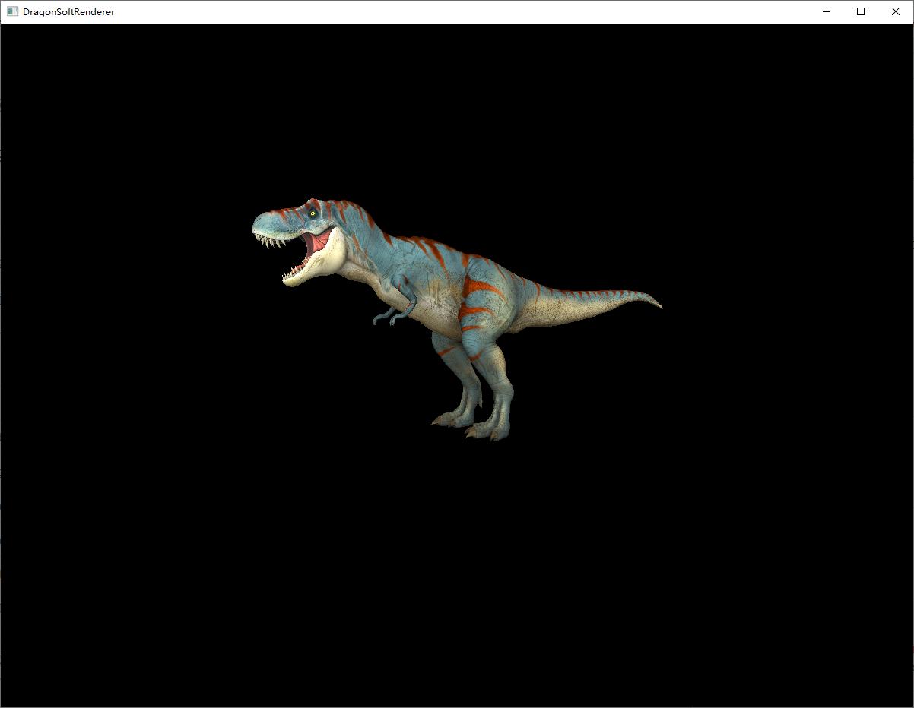
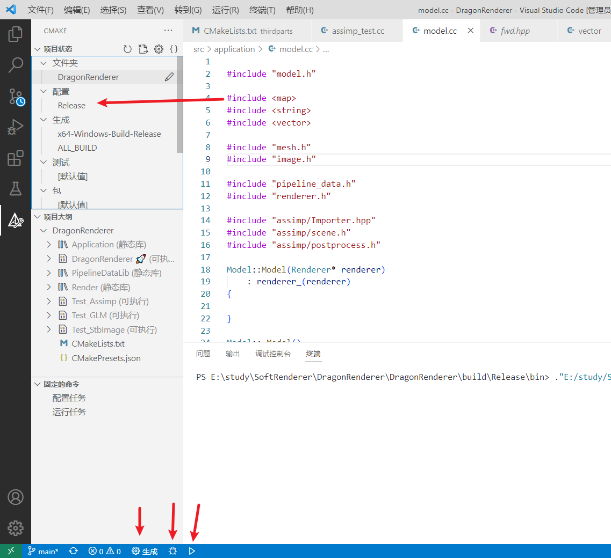

# DragonRenderer

DragonRenderer 是一个在 Windows 平台上运行的软件光栅化渲染器。项目目标是通过 C++ 手动实现一套近似 OpenGL 渲染管线的 API 和核心流程，用来学习图形学基础、渲染管线、光栅化、纹理采样、深度测试、模型加载和相机控制。



## 功能特性

- 软件光栅化渲染流程
- 直线和三角形光栅化
- 重心坐标插值
- 纹理加载与采样
- Alpha 混合
- 背面剔除
- Z-buffer 深度测试
- Sutherland-Hodgman 裁剪
- 透视相机与基础交互
- Lambert 光照 Shader
- 基于 Assimp 的模型加载实验

## 项目结构

```text
core/          渲染管线基础数据结构
render/        渲染器、缓冲区、相机、Shader、纹理、模型等核心实现
render/layer/  测试渲染层
render/shader/ 内置 Shader 实现
test/          第三方库和基础模块测试
assets/        运行时资源
thirdparts/    第三方依赖
```

更详细的模块边界、运行流程和后续架构演进路线见 [ARCHITECTURE.md](ARCHITECTURE.md)。

## 环境要求

- Windows
- Visual Studio 17 2022
- CMake >= 3.20

当前项目主要在 Windows + Visual Studio 2022 环境下自测。

## 构建与运行

### 使用 CMake Presets

```powershell
cmake --preset Debug
cmake --build --preset x64-Windows-Build-Debug
.\build\Debug\bin\DragonRenderer.exe
```

Release 构建：

```powershell
cmake --preset Release
cmake --build --preset x64-Windows-Build-Release
.\build\Release\bin\DragonRenderer.exe
```

### 手动 CMake 构建

Debug：

```powershell
cmake -S . -B build -D CMAKE_BUILD_TYPE=Debug
cmake --build build --config Debug
.\build\Debug\bin\DragonRenderer.exe
```

Release：

```powershell
cmake -S . -B build -D CMAKE_BUILD_TYPE=Release
cmake --build build --config Release
.\build\Release\bin\DragonRenderer.exe
```

## 测试

```powershell
ctest --test-dir build -C Debug -VV
```

或使用 CMake Presets：

```powershell
ctest --preset x64-Windows-Test-Debug
```

## VS Code 使用方式

安装 CMake Tools 插件后，打开项目根目录即可选择 `Debug`、`Release` 或 `RelWithDebInfo` preset 进行配置、构建和调试。



## 开发约定

- C++ 代码风格尽量遵循 Google C++ Style Guide。
- 提交信息建议使用下面的格式：

```text
[type](scope): subject

1. change detail
2. change detail
```

常用 `type`：

- `feature`: 新功能
- `fix`: 修复问题
- `docs`: 文档更新
- `refactor`: 重构
- `perf`: 性能优化
- `test`: 测试相关
- `chore`: 构建、工程或辅助任务

## 学习记录

开发过程中的阶段性记录保存在 [DEVLOG.md](DEVLOG.md)。
## License

This project is licensed under the MIT License. See [LICENSE](LICENSE) for details.

Unless otherwise noted, third-party dependencies, assets, course/tutorial materials, and externally sourced resources remain under their original licenses.
