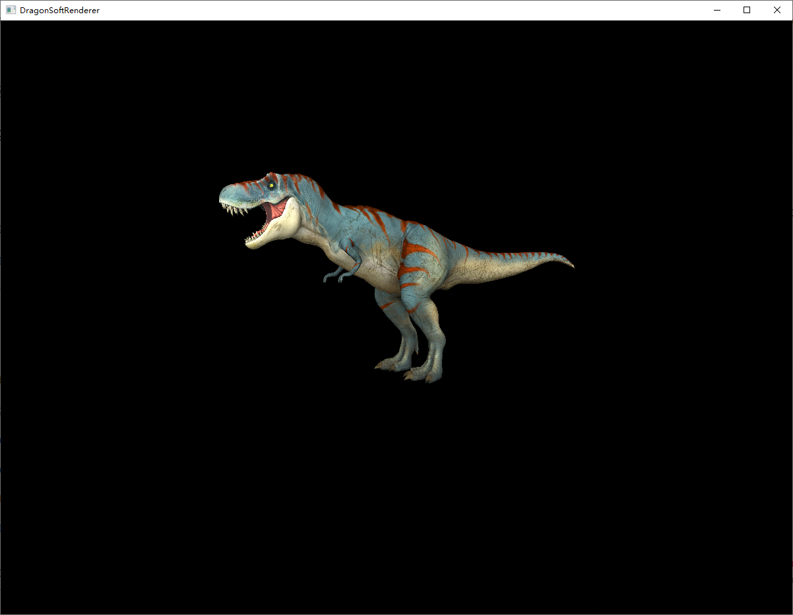
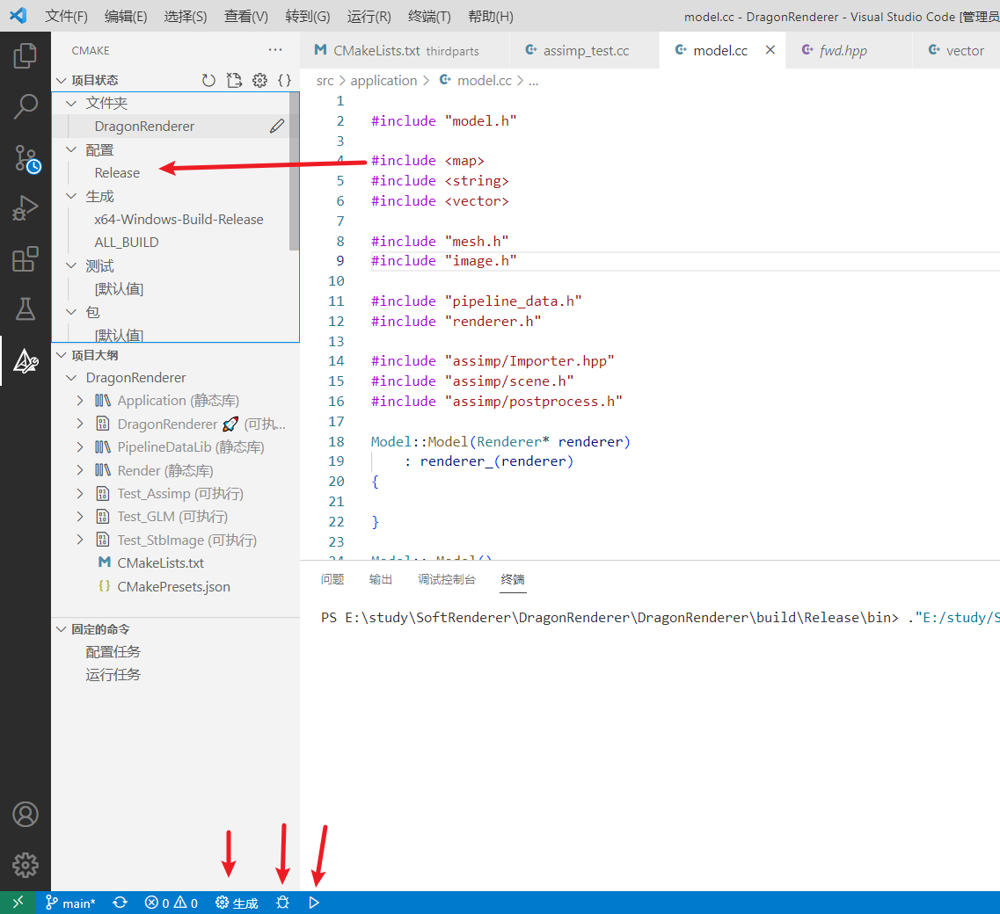

# DragonRenderer
一款全自主实现的模拟OpenGL渲染管线的API接口的软光栅渲染器，叫做：DragonSoftRenderer！




### DragonRenderer构建说明：

项目采用CMake 3.20构建，仅支持Windows平台，自测编译器套件为Visual Studio 17 2022


**方法1：手动命令行构建**

- debug版本

    ```
    (1) 生成配置:  cmake -S . -B build -D CMAKE_BUILD_TYPE=Debug
    (2) 编译 cmake --build build --config Debug
    (3) 运行: .\build\Debug\bin\DragonRenderer.exe
    (4) 单元测试:  进入build目录， test -C Debug -VV
    ```
    
- release版本

    ```
    (1) 生成配置:  cmake -S . -B build -D CMAKE_BUILD_TYPE=Release
    (2) 编译 cmake --build build --config Release
    (3) 运行: .\build\Debug\bin\DragonRenderer.exe
    (4) 单元测试:  进入build目录， test -C Release -VV
    ```


**方法2：vscode + CMakePresets.json预设自动构建**

安装CMake Tools插件，进入后会自动出现下图的左侧栏按钮，根据配置选择Debug或Release进行切换。

左下角的三个箭头分别表示：编译、调试运行、非调试运行

如下图：




**编码规范：** 遵循Google C++代码规范（尽量遵循）

**Git 提交记录规范格式说明：**

```
[<commit-type1>](<scope>):<subject>
1、xxxxxx
2、yyyyyy
3、zzzzzz

[<commit-type2>](<scope>):<subject>
1、xxxxxx
2、yyyyyy
3、zzzzzz
...
```

**commit-type表示提交类型（必选），分类如下：**

- feature
    新功能
- fix
    修复bug，可以是QA的，也可以是自己发现的
- docs
    添加 or 修改文档等
- refactor
    重构（不是新增功能，也不是修复bug）
- perf
    优化性能、体验等
- test
    增加单元测试、集成测试等
- chore
    构建过程的变动
- revert
    回滚到上一版本
- merge
    代码合并


**scope表示此次commit影响的范围（可选）！**

比如：1、某文件夹  2、界面层  3、模型层  4、某个库  等等


**subject表示此次commit提交的目的，一段简短的概述（可选）！**


**举个例子：**

```
[fix](application.cc文件): 忘记初始化某成员变量
1、补充成员变量main_window_width_的初始化
2、补充成员变量main_window_height_的初始化

[chore](application文件夹、根CMakeLists.txt): application单独编译成库，解耦
1、单独编译application文件夹，添加独立cmake文件
2、移除根cmake对application头文件包含，只需要target_link_library即可
```

