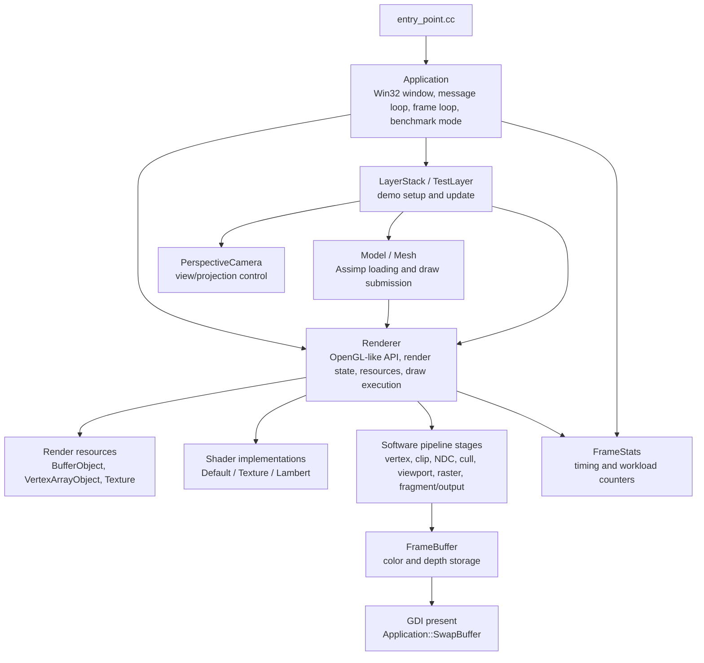
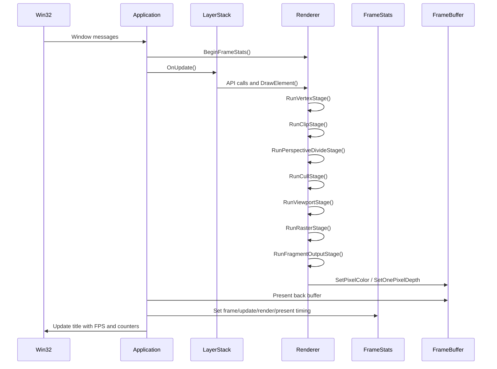
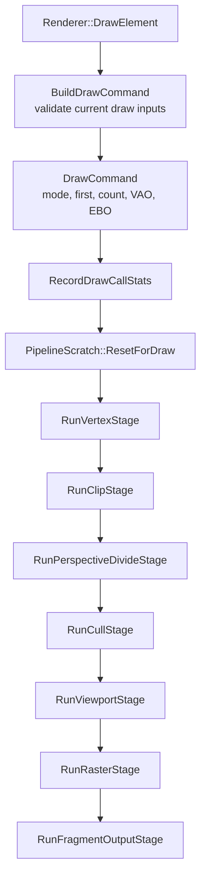
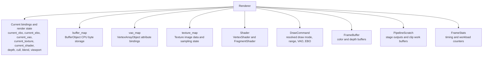
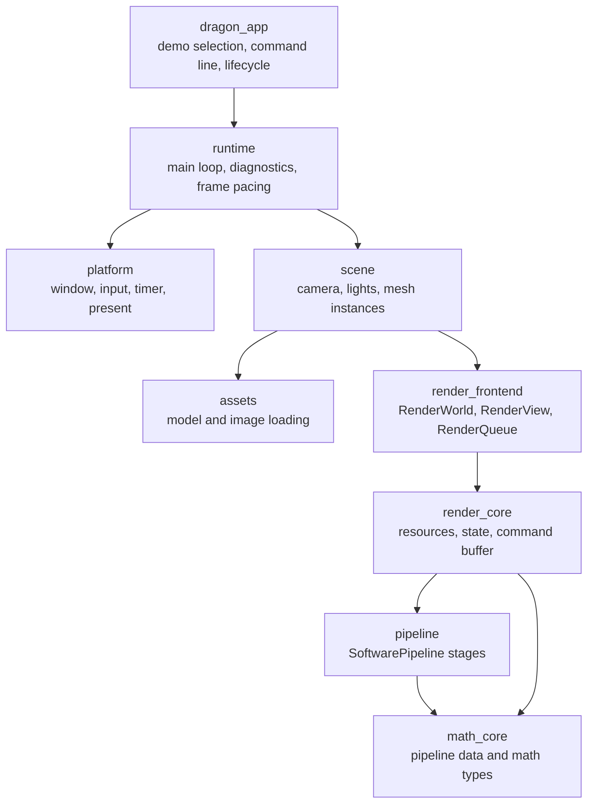

# DragonRenderer Architecture

This document records the current architecture, render data flow, and target direction for DragonRenderer.

The diagrams are intentionally close to the current codebase. They are not a marketing view of the engine; they are working diagrams for future refactoring, testing, and performance work.

## Current Architecture

## Frame Lifecycle

## Render Data Flow

```mermaid
flowchart LR
    Mesh["Mesh indices<br/>uint32 EBO"]
    VAO["VertexArrayObject<br/>attribute bindings"]
    VBO["BufferObject<br/>vertex data"]
    VS["Vertex shader<br/>Shader::VertexShader"]
    VSOut["vertex_outputs<br/>PipelineScratch"]
    Clip["ClipTool<br/>Sutherland-Hodgman"]
    ClipScratch["clip_work_a / clip_work_b<br/>PipelineScratch"]
    ClipOut["clip_outputs"]
    NDC["Perspective division<br/>NDC transform"]
    Cull["Cull stage<br/>optional back/front face culling"]
    Viewport["Screen mapping<br/>viewport transform"]
    Raster["RasterTool<br/>line / triangle rasterization"]
    Fragments["raster_outputs<br/>fragment candidates"]
    FS["Fragment shader<br/>Shader::FragmentShader"]
    Depth["Depth test<br/>FrameBuffer depth"]
    Blend["Optional blend"]
    Color["FrameBuffer color"]

    Mesh --> VS
    VAO --> VS
    VBO --> VS
    VS --> VSOut
    VSOut --> Clip
    ClipScratch <--> Clip
    Clip --> ClipOut
    ClipOut --> NDC
    NDC --> Cull
    Cull --> Viewport
    Viewport --> Raster
    Raster --> Fragments
    Fragments --> FS
    FS --> Depth
    Depth --> Blend
    Blend --> Color
```

## DrawElement Stage Boundary

`Renderer::DrawElement` is now an orchestration function. Each stage still lives inside `Renderer`, but the boundary is explicit enough to extract and test stages one by one.

## Resource And State Relationship

## Target Architecture Direction

The current renderer is still intentionally compact, but the desired shape is a layered engine where each layer can be replaced or tested independently.

## Refactor Guardrails

- Keep the demo running after every architecture step.
- Add tests before changing rasterization, clipping, or depth behavior.
- `render_output_smoke` draws a deterministic 16x16 offscreen triangle and checks pixel count, framebuffer checksum, draw calls, input triangles, and rasterized fragments.
- `clip_tool` covers clip-volume acceptance/rejection, line and triangle clipping, and front/back face culling semantics.
- `depth_output_smoke` draws overlapping offscreen triangles and checks color output, framebuffer checksum, fragment counts, and depth rejection behavior.
- `ndc_perspective_smoke` draws a clip-space triangle with varied `w` values and checks perspective divide, viewport mapping, perspective recovery, and deterministic color output.
- `draw_command_validation` checks that incomplete draw bindings, zero counts, short EBO data, and short VBO data do not enter the pipeline or record draw calls.
- Keep performance claims tied to `docs/PERFORMANCE_LOG.md`.
- Prefer extracting named boundaries before moving files.
- Avoid introducing a broad abstraction until a stage has a stable contract.

## Related Documents

- [Engine redesign roadmap](ENGINE_REDESIGN_ROADMAP.md)
- [Performance log](PERFORMANCE_LOG.md)
