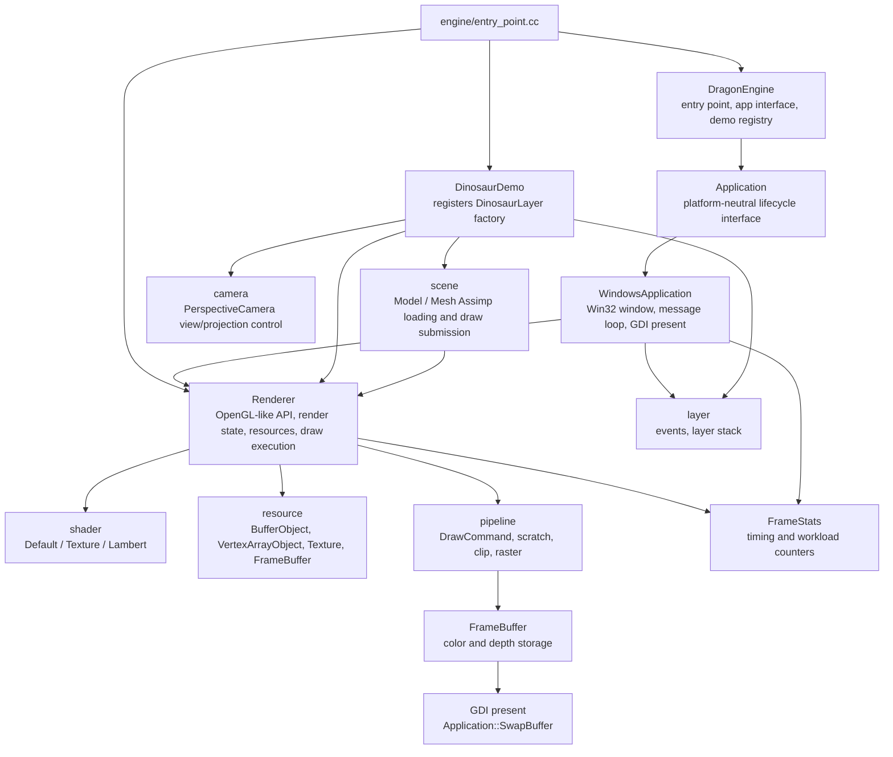
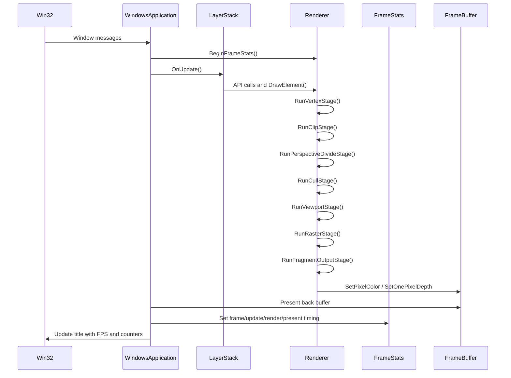
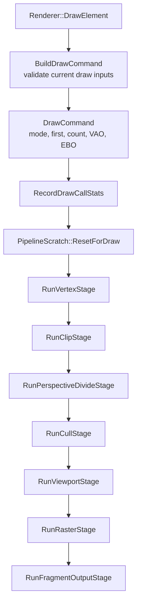
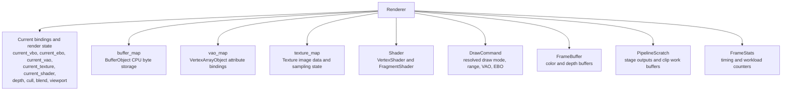
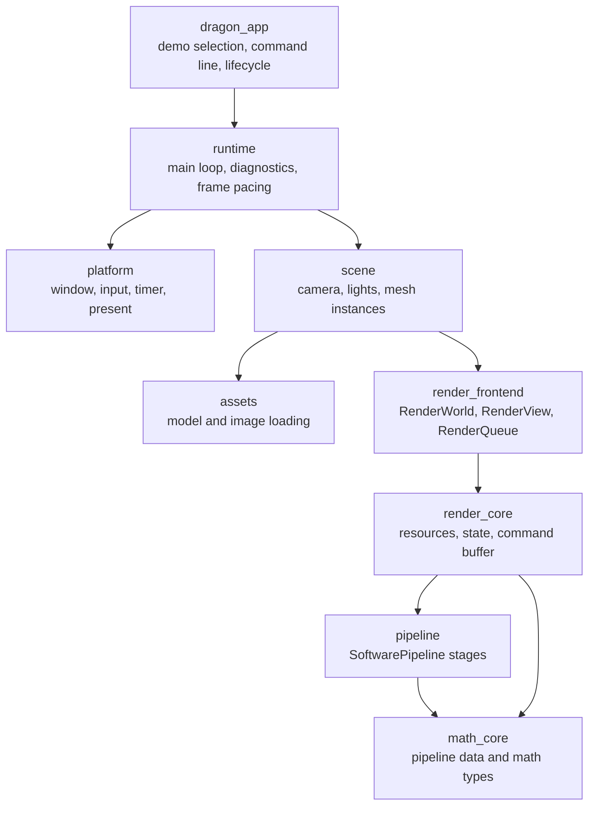

# DragonRenderer Architecture

This document records the current architecture, render data flow, and target direction for DragonRenderer.

The diagrams are intentionally close to the current codebase. They are not a marketing view of the engine; they are working diagrams for future refactoring, testing, and performance work.

## Current Architecture



## Physical Source Layout

The codebase is physically split into engine hosting, renderer core, and demo modules.

```text
engine/
  app/       platform-neutral Application lifecycle interface
  platform/
    win32/   WindowsApplication, Win32 window, message loop, GDI present
  entry_point.cc
             stable executable entry point and demo registry invocation
  demo_layer_registry.*
             engine-owned Layer factory registration boundary

render/
  camera/    camera abstractions and perspective camera
  layer/     events, layer interface, layer stack
  pipeline/  draw command, pipeline data, pipeline scratch, clipping, rasterization
  resource/  buffer, vertex array, texture, image, framebuffer
  runtime/   frame statistics and scoped timing
  scene/     model and mesh loading/submission
  shader/    shader base class and built-in shader implementations

demos/
  dinosaur/  DinosaurLayer and demo-specific model setup
```

The current include style still uses short project headers such as `renderer.h`, `clip_tool.h`, and `shader/default_shader.h`. CMake exposes each module directory through `target_include_directories` so this first physical split does not force broad include churn.

`pipeline_data.h` used to live in a top-level `core/` folder. It is now owned by `render/pipeline/` because the types inside it are render-pipeline-facing contracts rather than a standalone engine core.

`DinosaurDemo` now lives outside the `Render` static library. `DragonRenderer.exe` links `Render` and `DinosaurDemo`; the demo module implements `RegisterDemoLayers(DemoLayerRegistry&)` and registers its own layer factory with the engine-owned registry. The entry point only consumes registered `Layer` instances and does not include concrete demo layer headers.

## Build Target Layout

DragonRenderer currently builds project code as static/object libraries plus one executable:

```text
DragonEngine object library
  Program entry point, platform-neutral Application interface,
  WindowsApplication implementation, command-line parsing, demo layer registry,
  and render loop startup.

Render.lib
  Renderer core, layer extension points, camera, resources, scene loading,
  shaders, pipeline stages, and runtime stats.

DinosaurDemo.lib
  DinosaurLayer, demo-specific model/shader setup, and RegisterDemoLayers
  registration implementation.

DragonRenderer.exe
  Links DragonEngine, Render, and DinosaurDemo.
```

There is no project-owned DLL boundary yet. Runtime DLLs may still come from third-party dependencies such as Assimp, but the project's own code is linked through static libraries.

## Encoding Policy

All project-owned text files must be valid UTF-8. The repository enforces this in three places:

- `.editorconfig` sets `charset = utf-8` for editors.
- `.gitattributes` declares UTF-8 text normalization for source, CMake, docs, and scripts.
- CMake builds with MSVC `/utf-8` and runs the `check_utf8` target plus the `utf8_encoding` CTest.

Vendored dependencies, binary assets, generated build files, and image assets are excluded from the UTF-8 scan.

## Frame Lifecycle



## Render Data Flow

```mermaid
flowchart LR
    Mesh["Mesh indices<br/>uint32 EBO"]
    VAO["VertexArrayObject<br/>attribute bindings"]
    VBO["BufferObject<br/>vertex data"]
    VS["Vertex shader<br/>Shader::VertexShader"]
    VSOut["vertex_outputs<br/>PipelineScratch"]
    Clip["ClipTool<br/>Sutherland-Hodgman"]
    ClipScratch["clip_work_a / clip_work_b<br/>PipelineScratch"]
    ClipOut["clip_outputs"]
    NDC["Perspective division<br/>NDC transform"]
    Cull["Cull stage<br/>optional back/front face culling"]
    Viewport["Screen mapping<br/>viewport transform"]
    Raster["RasterTool<br/>line / triangle rasterization"]
    Fragments["raster_outputs<br/>fragment candidates"]
    FS["Fragment shader<br/>Shader::FragmentShader"]
    Depth["Depth test<br/>FrameBuffer depth"]
    Blend["Optional blend"]
    Color["FrameBuffer color"]

    Mesh --> VS
    VAO --> VS
    VBO --> VS
    VS --> VSOut
    VSOut --> Clip
    ClipScratch <--> Clip
    Clip --> ClipOut
    ClipOut --> NDC
    NDC --> Cull
    Cull --> Viewport
    Viewport --> Raster
    Raster --> Fragments
    Fragments --> FS
    FS --> Depth
    Depth --> Blend
    Blend --> Color
```



## DrawElement Stage Boundary

`Renderer::DrawElement` is now an orchestration function. Each stage still lives inside `Renderer`, but the boundary is explicit enough to extract and test stages one by one.



## Resource And State Relationship



## Target Architecture Direction

The current renderer is still intentionally compact, but the desired shape is a layered engine where each layer can be replaced or tested independently.



## Refactor Guardrails

- Keep the demo running after every architecture step.
- Add tests before changing rasterization, clipping, or depth behavior.
- `render_output_smoke` draws a deterministic 16x16 offscreen triangle and checks pixel count, framebuffer checksum, draw calls, input triangles, and rasterized fragments.
- `clip_tool` covers clip-volume acceptance/rejection, line and triangle clipping, and front/back face culling semantics.
- `depth_output_smoke` draws overlapping offscreen triangles and checks color output, framebuffer checksum, fragment counts, and depth rejection behavior.
- `ndc_perspective_smoke` draws a clip-space triangle with varied `w` values and checks perspective divide, viewport mapping, perspective recovery, and deterministic color output.
- `draw_command_validation` checks that incomplete draw bindings, zero counts, short EBO data, and short VBO data do not enter the pipeline or record draw calls.
- Keep performance claims tied to `docs/PERFORMANCE_LOG.md`.
- Prefer extracting named boundaries before moving files.
- Avoid introducing a broad abstraction until a stage has a stable contract.

## Related Documents

- [Documentation index and governance](README.md)
- [Engine redesign roadmap](ENGINE_REDESIGN_ROADMAP.md)
- [Performance log](PERFORMANCE_LOG.md)
- [Project log](PROJECT_LOG.md)
